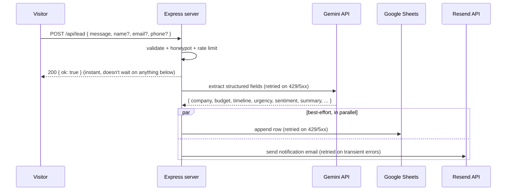

# Lead Extractor

A landing page with an inquiry form that turns free-text messages into structured CRM leads —
no manual data entry. Built as a single small Node/Express service: one deploy, no separate
frontend hosting, no message queue or database to run.

**Live flow:** visitor writes a few sentences → Gemini extracts structured fields → the lead is
appended to a Google Sheet → a formatted notification email goes out — all in the background,
after the visitor has already been told "got it."



If Gemini extraction fails even after retries, the raw message is still saved to the sheet
instead of the lead being silently dropped.

## Contents

- [Why it's built this way](#why-its-built-this-way)
- [Security measures already in place](#security-measures-already-in-place)
- [Setup](#setup)
  1. [Install](#1-install)
  2. [Get a Gemini API key](#2-get-a-gemini-api-key)
  3. [Set up the Google Sheet](#3-set-up-the-google-sheet)
  4. [Set up outgoing email (Resend)](#4-set-up-outgoing-email-resend-http-api)
  5. [Run it locally](#5-run-it-locally)
  6. [Run the tests](#6-run-the-tests)
  7. [Deploy](#7-deploy)
- [Project structure](#project-structure)
- [Notes on the extracted fields](#notes-on-the-extracted-fields)
- [Troubleshooting](#troubleshooting)
- [Extending this](#extending-this)
- [License](#license)

## Why it's built this way

- **One process, no infra**: Express serves both the static landing page and the `POST /api/lead`
  API. Deploys as a single Node app anywhere that runs a persistent process.
- **The visitor never waits on a third-party API**: the response is sent immediately after
  validation; Gemini/Sheets/email happen afterward with their own retry logic. A slow or flaky
  upstream call never makes a real submission look like it failed.
- **Nothing is lost on partial failure**: Sheets append and email send run independently
  (`Promise.allSettled`) — if one fails, the other still happens, and both failures are logged.
- **Every external call retries with backoff**, but only for errors worth retrying (429/5xx or
  network errors). Bad input or bad auth fails fast instead of burning retries.
- **Email goes out over HTTPS, not SMTP** (via [Resend](https://resend.com)), so it keeps working
  on hosts that block outbound SMTP ports — Render's free tier being a common example.

## Security measures already in place

| Concern | Mitigation |
|---|---|
| Bots / scraping | Honeypot field (`company_website`) + per-IP rate limits (global + a tighter one on `/api/lead`, since that route costs money per request) |
| Cross-site submission | Optional `ALLOWED_ORIGINS` allow-list checked against `Origin`/`Referer` |
| Oversized / malformed payloads | 10 KB JSON body limit; malformed JSON returns a clean 400 instead of a 500 |
| Header/log injection via form fields | Control and zero-width characters are stripped from every text field before use |
| IP spoofing behind a proxy | `trust proxy` is off by default — only enable `TRUST_PROXY` if you're actually behind one (Render/Railway/Nginx), or rate limiting can be bypassed |
| Basic HTTP hardening | [`helmet`](https://www.npmjs.com/package/helmet) security headers on every response |
| Secrets in the repo | `.gitignore` excludes `.env`, `*.pem`, `*.key`, and common service-account filename patterns |

None of this replaces a WAF or CAPTCHA for a page under active abuse — see [Extending
this](#extending-this) for what to add if that becomes necessary.

## Setup

### 1. Install

```bash
npm install
cp .env.example .env
```

Fill in `.env` — see below for where each value comes from.

### 2. Get a Gemini API key

1. Go to https://aistudio.google.com/apikey and create a key.
2. Put it in `.env` as `GEMINI_API_KEY`.
3. `GEMINI_MODEL` defaults to `gemini-2.5-flash`. Google renames/retires model versions fairly
   often — if you get a 404 saying a model "is no longer available," check
   https://ai.google.dev/gemini-api/docs/models for the current name and update `GEMINI_MODEL`.
   No code changes needed for a model swap within the same family.

### 3. Set up the Google Sheet

1. In [Google Cloud Console](https://console.cloud.google.com/), create (or reuse) a project and
   enable the **Google Sheets API**.
2. Create a **Service Account** (IAM & Admin → Service Accounts), then create a **JSON key** for
   it and download it.
3. From that JSON file, copy:
   - `client_email` → `.env` as `GOOGLE_SERVICE_ACCOUNT_EMAIL`
   - `private_key` → `.env` as `GOOGLE_PRIVATE_KEY` (keep it in quotes, keep the `\n` sequences
     literal)
4. Create a Google Sheet (or use an existing one). Copy the ID from its URL:
   `https://docs.google.com/spreadsheets/d/`**`THIS_PART`**`/edit` → `.env` as `SHEET_ID`.
5. **Share the sheet** with the service account's email (the `client_email` above) and give it
   **Editor** access — otherwise it can't write to it.
6. `SHEET_TAB_NAME` (default `Leads`) is the tab it will create/use. You don't need to create the
   tab or header row yourself — the app does that automatically on the first submission.

### 4. Set up outgoing email (Resend HTTP API)

Emails are sent via [Resend](https://resend.com)'s HTTPS API rather than SMTP, so this keeps
working on hosts that block outbound SMTP ports (e.g. Render's free tier blocks 25/465/587 —
Gmail SMTP would silently time out there).

1. Sign up at https://resend.com and create an API key: https://resend.com/api-keys.
2. Put it in `.env` as `RESEND_API_KEY`.
3. Without a verified domain, new accounts are limited to Resend's test address,
   `onboarding@resend.dev`, as the `from`, and can only deliver `to` the email address you signed
   up with. Use that for local testing:
   ```
   FROM_EMAIL=Lead Bot <onboarding@resend.dev>
   NOTIFY_EMAIL=you@yourpersonalemail.com
   ```
4. To send from your own name/domain and to other recipients, verify a domain you own at
   https://resend.com/domains (a few DNS records added at your registrar — this can't be a
   `*.onrender.com`/`*.vercel.app` style platform subdomain, since you don't control its DNS).
   Then set `FROM_EMAIL` to an address on that domain, e.g. `"Lead Bot <leads@yourdomain.com>"`.
5. Set `NOTIFY_EMAIL` to wherever you want alerts sent.
6. **No surrounding quotes when pasting into a host's environment-variable UI** (Render, Railway,
   etc.) — quotes in `.env.example` are a local-file convention that `dotenv` strips automatically;
   pasted literally into a dashboard field, they become part of the value and Resend will reject it
   with a 422 `Invalid from field` error.

### 5. Run it locally

```bash
npm start        # or: npm run dev   (auto-restarts on file changes)
```

Visit `http://localhost:3000`, submit the form, and check:
- The terminal for errors
- Your Google Sheet for the new row
- Your inbox for the notification email

### 6. Run the tests

```bash
npm test
```

Covers input validation (the security boundary for `/api/lead`) and the retry/backoff helper
used by every external call. A GitHub Actions workflow (`.github/workflows/ci.yml`) runs this on
every push/PR against Node 18 and 20.

### 7. Deploy

**Option A — any Node host (Render, Railway, Fly.io, a small VPS):**

1. Push this project to a GitHub repo.
2. On Render: New → Web Service → connect the repo.
   - Build command: `npm install`
   - Start command: `npm start`
   - Add every variable from `.env` under "Environment" (unquoted — see the note in step 4 above),
     plus `TRUST_PROXY=true` (Render sits behind a proxy) and `ALLOWED_ORIGINS` set to your real
     domain.
3. Once deployed, the landing page and API are both live at the same URL. The startup log always
   prints `http://localhost:$PORT` — that's just what the app logs internally on boot, not a sign
   it's only reachable locally; Render's `Your service is live 🎉` line is the one that confirms
   it's publicly reachable.

**Option B — Docker:**

```bash
docker build -t lead-extractor .
docker run -p 3000:3000 --env-file .env lead-extractor
```

The image runs as a non-root user and exposes `/api/health` as its `HEALTHCHECK`.

(Vercel can also run this, but its serverless functions are better suited to short requests — an
always-on host is more predictable here.)

## Project structure

```
lead-extractor/
├── server.js               # Express app: serves the page + POST /api/lead, graceful shutdown
├── src/
│   ├── validators.js       # Input validation — the security boundary for /api/lead
│   ├── security.js         # Rate limiting + optional origin allow-list
│   ├── geminiExtractor.js  # Calls Gemini, returns structured lead fields
│   ├── sheetsService.js    # Appends a row to your Google Sheet (creates tab/header on first use)
│   ├── mailer.js           # Sends the notification email via the Resend HTTP API
│   └── retry.js            # Shared exponential-backoff retry helper
├── test/                   # node --test unit tests for validators + retry
├── public/
│   └── index.html          # The landing page (edit freely)
├── .github/workflows/ci.yml
├── Dockerfile
├── .env.example
└── package.json
```

## Notes on the extracted fields

Gemini is asked to return, per submission:

| Field | Description |
|---|---|
| `name`, `email`, `phone` | Taken from the form fields if filled in, otherwise inferred from the message text |
| `company` | Pulled from the message if mentioned |
| `service_interested` | What they're asking about, in a few words |
| `budget` | Any figure/range mentioned, as written |
| `timeline` | Any deadline mentioned, as written |
| `requirement_summary` | A one-to-two sentence plain-English summary |
| `urgency` | `low` / `medium` / `high` |
| `sentiment` | `positive` / `neutral` / `negative` |

It's told explicitly not to invent values it can't find in the text — missing fields come back
`null` rather than guessed.

## Troubleshooting

| Symptom | Likely cause | Fix |
|---|---|---|
| Sheet updates fine, but no email — no errors anywhere | `sendLeadEmail` only logs on failure; a successful send with the wrong recipient looks identical to silence | Check spam/promotions on `NOTIFY_EMAIL`; confirm it isn't typo'd |
| Works locally, not on Render (or similar), even with correct env vars | Free-tier hosts commonly block outbound SMTP ports 25/465/587 | Already solved here by sending via Resend's HTTPS API instead of SMTP |
| `Resend API error 422: Invalid from field` | Quotes from `.env.example` pasted literally into a host's env-var UI | Remove surrounding quotes; the value should be e.g. `Lead Bot <you@domain.com>`, no quote characters |
| `403` from Resend, "You can only send testing emails to your own email address" | Sending from `onboarding@resend.dev` to someone other than your account email | Either send only to your Resend account email, or verify a real domain |
| Resend won't verify a `*.onrender.com` / `*.vercel.app` domain | You don't control DNS for a platform's shared domain | Use a domain you actually own and registered, or stay on the `onboarding@resend.dev` test address |
| Startup log says `running on http://localhost:3000` on a live host | That's just a hardcoded string the app logs on boot | Harmless — check `==> Your service is live` (Render) or hit `/api/health` to confirm |

## Extending this

- **Heavier spam protection**: for a public page getting real traffic, add reCAPTCHA/hCaptcha in
  front of the honeypot + rate limits already in place.
- **CRM instead of a Sheet**: swap `src/sheetsService.js` for a call to your CRM's API (HubSpot,
  Pipedrive, Airtable, etc.) — the rest of the app doesn't need to change.
- **Slack instead of / in addition to email**: add a small `src/slack.js` that posts to a Slack
  incoming webhook, and call it alongside `sendLeadEmail` in `server.js`.
- **Structured logging**: `console.log`/`console.error` are fine at this scale; swap in
  `pino`/`winston` if you need log aggregation in production.

## License

MIT — see [LICENSE](LICENSE).# Kestrel-DEMO--Lead-Extractor

# Kestrel-DEMO--Lead-Extractor

